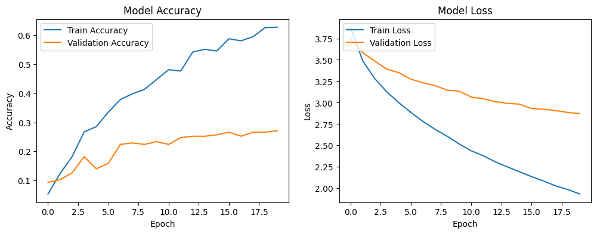
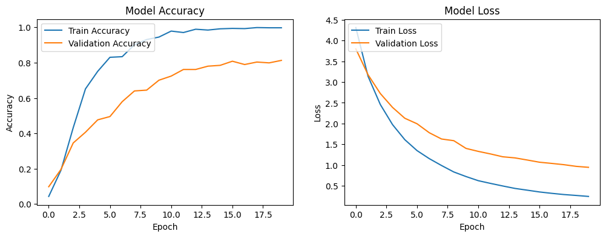
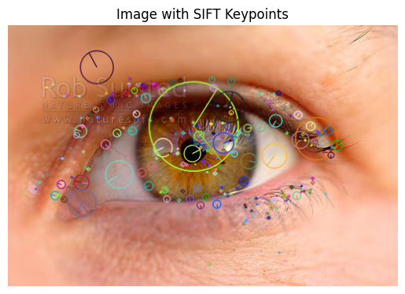
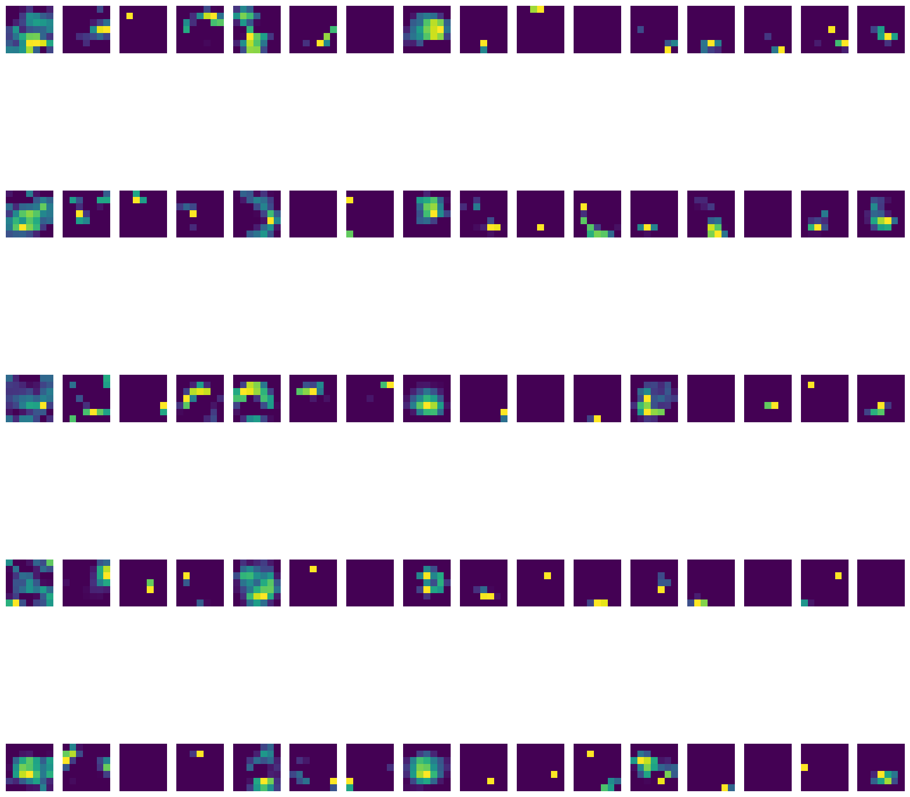

# 👁️ DeepLearning-Ablation-Study-Biometric-Classification

## Project Title: Empirical Analysis of DCNN Performance, Efficiency, and Interpretability for High-Class Biometric Classification

###  📖 Project Summary
This repository documents a comprehensive **Ablation Study** focused on optimizing Deep Convolutional Neural Networks (DCNNs) for a challenging 50-class iris recognition task. The research systematically evaluates performance trade-offs, analyzes critical failures (SIFT), implements robust regularization, and benchmarks a lightweight architecture for edge deployment.

The work demonstrates advanced expertise in **Model Debugging, Numerical Stability, Performance Benchmarking, and Explainable AI (XAI)**.

---

### 🎯 Core Experimental Findings (Model Failure and Success)

#### 1. Quantified Failure of Feature Fusion
A core experiment tested the efficacy of pre-processing the data with traditional SIFT features. This approach led to a catastrophic performance drop ($\sim 28\%$ Val Acc), empirically proving that **DCNNs perform optimally with minimal feature interference**.

*   **Failure Analysis Plot:** The low accuracy confirms the hypothesis that the SIFT-fusion pipeline is detrimental.
    

#### 2. Model Performance and Efficiency Trade-off
The optimal pipeline (ResNet50 + simple normalization) achieved the highest benchmark, while MobileNetV2 provided a deployment-ready solution.

*   **Peak Performance Plot:** The final achieved accuracy plot demonstrates excellent generalization (low gap).
    

---

### ⚙️ Feature Analysis and Interpretability (XAI)

The project heavily focused on analyzing the features the model learned and how traditional methods compared to the DCNN's internal representations.

#### 1. Traditional Feature Exploration
(Code: `01_Preprocessing_Features/`)
Classical methods were used to inform the pipeline design, revealing the texture complexity of the iris data.

*   **SIFT and LBP Visualization:** These feature maps illustrate the difference between keypoint detection and local pattern encoding, crucial for understanding the data's complexity.
    

*   **SIFT Descriptor Detail:** Detailed visualization of the SIFT keypoints, showing their orientation and scale invariance (the circles), which is critical for robust feature detection.
    

*   **Misclassification Insight:** Analysis of failed predictions on heavily processed images reinforces the conclusion that complex inputs often confuse the model.
    

#### 2. DCNN Interpretability
(Code: `04_Interpretability_Analysis/`)

*   **Activation Grid:** Visualization of the deep convolutional layer confirms the DCNN is focusing its activation on **high-frequency textural patterns**, validating its utility as a pure biometric feature extractor.
    

---

### 🚀 Conclusion & Future Work
This project demonstrates that Transfer Learning provides a powerful feature base, but its success in fine-grained biometrics relies entirely on **Abandoning traditional feature fusion** and applying **rigorous regularization**. The primary remaining challenge lies in correcting for non-frontal gaze and occlusion errors.

**Future Research Directions (Ph.D. Focus):**
1.  **Metric Learning:** Integrating ArcFace or Triplet Loss to enhance inter-class separation for texture-similar subjects.
2.  **Normalization Module:** Developing a dedicated DCNN-based module to correct for the observed gaze-based errors.

---

### 📫 Contact Information
Email: ikba.king2015@gmail.com
LinkedIn: [linkedin.com/in/yahiaoui-raiane-253911262](https://www.linkedin.com/in/yahiaoui-raiane-253911262)

### 📄 License
This project is open for academic use and further research.
